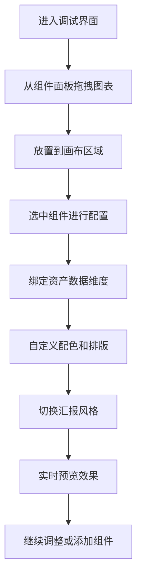

## 1. 产品概述

资产汇报可视化页面配置服务，提供纯线上的拖拽式图表布局调试平台。用户可以通过自由拖拽折线、环形、柱状等图表组件，绑定私人资产数据维度，自定义配色、排版和布局，实时预览完整的资产汇报页面效果。

- 核心价值：让非技术用户快速生成专业级资产汇报可视化页面，无需编写代码
- 目标用户：高净值人士、理财顾问、资产管理者
- 市场价值：提升资产汇报的专业度和效率，支持两种高端风格切换

## 2. 核心功能

### 2.1 用户角色
| 角色 | 注册方式 | 核心权限 |
|------|----------|----------|
| 普通用户 | 直接访问 | 使用全部配置功能、实时预览、切换风格 |

### 2.2 功能模块
1. **组件面板**：提供折线图、环形图、柱状图、文本块、数据卡片等可拖拽组件
2. **画布区域**：支持自由拖拽布局、组件调整、实时预览
3. **配置面板**：图表数据绑定、配色设置、文字排版、样式配置
4. **风格切换**：极简商务、高端奢华两种汇报风格一键切换
5. **数据服务**：后端提供各类私人资产维度的模拟数据接口

### 2.3 页面详情
| 页面名称 | 模块名称 | 功能描述 |
|----------|----------|----------|
| 主调试页面 | 左侧组件面板 | 展示可拖拽的图表组件列表，支持拖拽到画布 |
| 主调试页面 | 中间画布区域 | 资产汇报页面实时预览，支持组件拖拽、调整大小、删除 |
| 主调试页面 | 右侧配置面板 | 选中组件的详细配置：数据绑定、配色、字体、布局 |
| 主调试页面 | 顶部工具栏 | 风格切换按钮、清空画布、导出配置（仅内存） |

## 3. 核心流程

用户进入调试界面 → 从左侧组件面板拖拽图表到画布 → 选中组件在右侧配置数据维度 → 自定义配色和排版 → 切换风格预览效果 → 实时查看完整资产汇报页面

## 4. 用户界面设计

### 4.1 设计风格

**极简商务风格**：
- 主色：深空蓝 `#1e3a5f`，辅助色：银灰 `#8c9bab`，强调色：金色 `#c9a962`
- 按钮：扁平化、直角、细边框
- 字体：思源黑体 + Playfair Display（标题）
- 布局：大量留白、网格化、简约克制

**高端奢华风格**：
- 主色：深酒红 `#722f37`，辅助色：香槟金 `#d4af37`，强调色：象牙白 `#fffff0`
- 按钮：渐变、圆角、金属质感边框、阴影
- 字体：Playfair Display（标题）+ 思源宋体（正文）
- 布局：装饰性边框、丝绒质感背景、优雅的排版层次

### 4.2 页面设计概述
| 页面名称 | 模块名称 | UI 元素 |
|----------|----------|----------|
| 主调试页面 | 组件面板 | 卡片式组件预览、拖拽效果、悬停高亮 |
| 主调试页面 | 画布区域 | 网格背景、选中态边框、拖拽占位符、组件调整手柄 |
| 主调试页面 | 配置面板 | 分组折叠面板、颜色选择器、下拉选择、滑块控件 |
| 主调试页面 | 顶部工具栏 | 风格切换胶囊按钮、操作按钮组、状态指示 |

### 4.3 响应性
- 桌面端优先设计，三栏布局（25% / 50% / 25%）
- 画布区域自适应，保证预览效果的完整性
- 配置面板支持滚动，适配不同高度的配置项

### 4.4 动效设计
- 组件拖拽时的半透明跟随效果
- 画布放置时的平滑过渡动画
- 风格切换时的整体渐隐渐现过渡（800ms）
- 图表数据加载时的渐入动画
- 配置修改时的实时预览微动画
