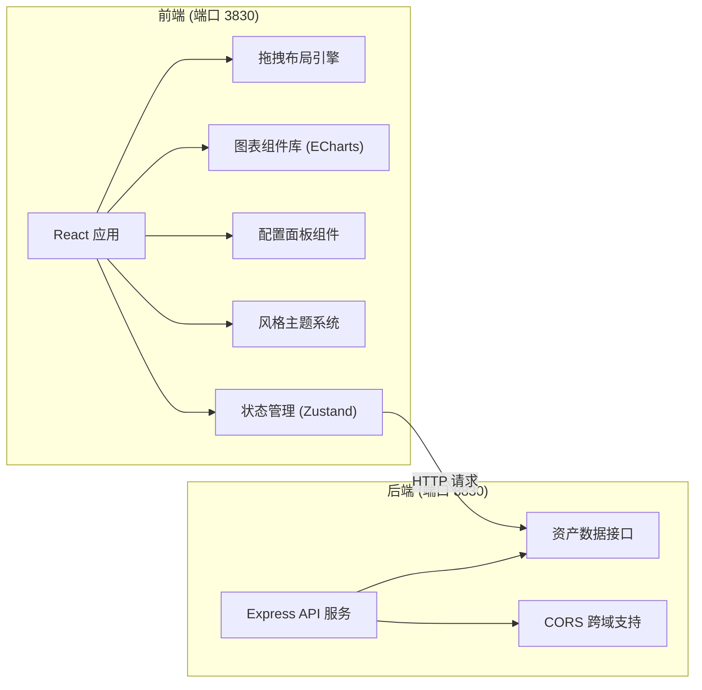
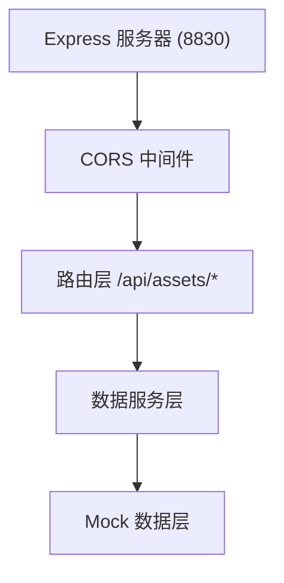

## 1. 架构设计



## 2. 技术栈

- **前端**: React@18 + TypeScript + Vite + TailwindCSS@3 + Zustand + ECharts
- **后端**: Express@4 + TypeScript
- **拖拽**: 原生 HTML5 Drag & Drop API
- **图表**: ECharts@5
- **图标**: Lucide React
- **状态管理**: Zustand

## 3. 端口分配
- 前端调试界面: 3830 端口
- 后端数据服务: 8830 端口

## 4. 目录结构

```
├── src/                          # 前端代码
│   ├── components/
│   │   ├── charts/             # 图表组件
│   │   │   ├── LineChart.tsx   # 折线图
│   │   │   ├── PieChart.tsx    # 环形图
│   │   │   └── BarChart.tsx   # 柱状图
│   │   ├── layout/             # 布局组件
│   │   │   ├── ComponentPanel.tsx
│   │   │   ├── Canvas.tsx
│   │   │   └── ConfigPanel.tsx
│   │   │   └── Toolbar.tsx
│   │   └── common/             # 通用组件
│   │       ├── Draggable.tsx
│   │       └── StyleSwitch.tsx
│   │       └── ColorPicker.tsx
│   ├── store/                    # 状态管理
│   │   └── useCanvasStore.ts
│   ├── hooks/                    # 自定义 hooks
│   │   └── useDragDrop.ts
│   ├── pages/
│   │   └── Editor.tsx          # 主编辑页面
│   ├── types/                    # 类型定义
│   │   └── index.ts
│   ├── utils/                    # 工具函数
│   │   ├── theme.ts            # 主题配置
│   │   └── api.ts             # API 封装
│   ├── App.tsx
│   └── main.tsx
├── api/                          # 后端代码
│   ├── index.ts                 # Express 入口
│   ├── routes/
│   │   └── assets.ts          # 资产数据接口
│   ├── data/
│   │   └── mockData.ts        # 模拟资产数据
│   └── types/
│       └── index.ts
├── shared/                       # 共享类型
│   └── index.ts
├── vite.config.ts
├── tailwind.config.js
├── tsconfig.json
└── package.json
```

## 5. 路由定义

| 路由 | 说明 |
|------|------|
| / | 主调试编辑页面 |

## 6. API 定义

### 6.1 资产概览数据
```typescript
// GET /api/assets/overview

interface AssetOverview {
  totalAssets: number;
  yearGrowth: number;
  monthGrowth: number;
  riskLevel: string;
}
```

### 6.2 资产分类数据
```typescript
// GET /api/assets/categories

interface AssetCategory {
  name: string;
  value: number;
  percentage: number;
}
```

### 6.3 资产趋势数据
```typescript
// GET /api/assets/trend?period=12m

interface AssetTrend {
  date: string;
  value: number;
  growth: number;
}[]
```

### 6.4 投资收益数据
```typescript
// GET /api/assets/income

interface InvestmentIncome {
  category: string;
  income: number;
  rate: number;
}[]
```

### 6.5 资产配置数据
```typescript
// GET /api/assets/allocation

interface AssetAllocation {
  type: string;
  current: number;
  target: number;
}[]
```

## 7. 核心数据模型

### 7.1 画布组件模型
```typescript
interface CanvasComponent {
  id: string;
  type: 'line' | 'pie' | 'bar' | 'text' | 'card';
  x: number;
  y: number;
  width: number;
  height: number;
  config: ComponentConfig;
  dataBinding: DataBinding;
}

interface ComponentConfig {
  title: string;
  colors: string[];
  fontSize: number;
  fontFamily: string;
  showLegend: boolean;
  borderRadius: number;
}

interface DataBinding {
  dataSource: string;
  dimension: string;
  aggregation: 'sum' | 'avg' | 'count';
}
```

### 7.2 主题配置
```typescript
interface ThemeConfig {
  name: 'minimal' | 'luxury';
  colors: {
    primary: string;
    secondary: string;
    accent: string;
    background: string;
    text: string;
  };
  typography: {
    headingFont: string;
    bodyFont: string;
  };
}
```

## 8. 后端架构


